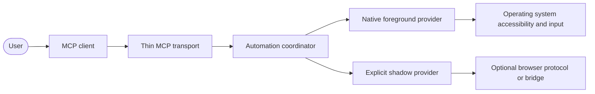
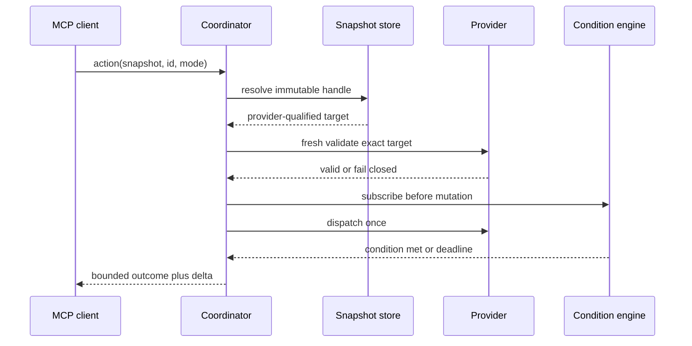
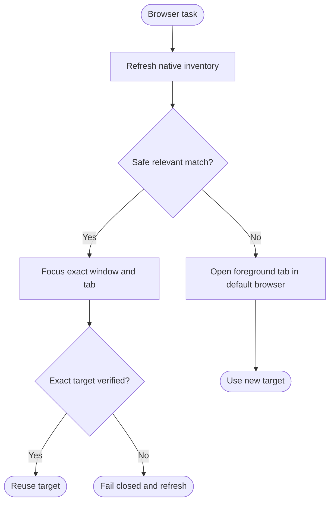
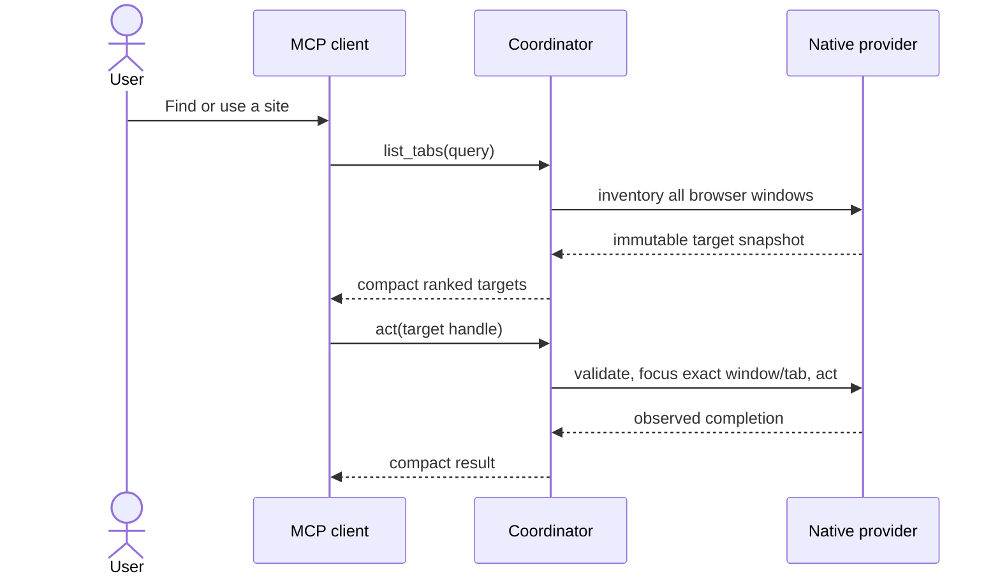
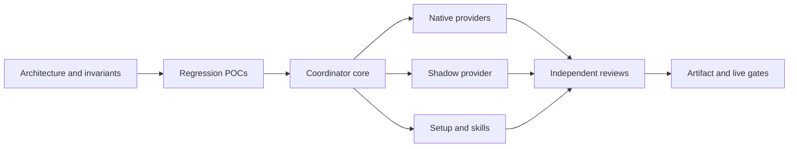

# Design Document: Production-Safe Computer-Use Runtime

**Status:** Approved for implementation
**Author:** Codex
**Reviewers:** Repository owner
**Last updated:** 2026-07-17
**Related:** [Native-first v2 design](2026-07-17-agent-eyes-v2-native-first-design.md), [bootstrap implementation record](2026-07-17-agent-eyes-v2-bootstrap-implementation-plan.md)

---

## 1. Overview

This design replaces Agent Eyes' module-level mutable automation state with a broker-ready in-process coordinator. The coordinator owns immutable observation snapshots, exact provider-qualified targets, serialized foreground mutations, request deadlines, output/input budgets, and event-backed completion. Native accessibility remains the universal foreground plane; remote browser protocols remain explicit shadow capabilities.

## 2. Goals

- Never dispatch input or a destructive action to an ambiguous, stale, wrong-process, wrong-window, or wrong-tab target.
- Reuse relevant tabs across all accessibility-visible browsers before opening a new tab.
- Require explicit caller intent for every shadow/background action.
- Return as soon as the requested state is observable, without orchestration sleeps.
- Keep common orientation and action flows compact enough for small-context models.
- Provide truthful capability and dependency setup on macOS, Windows, and Linux.
- Produce one validated package and skill contract that Codex, Claude, and other MCP clients can install persistently.

## 3. Non-Goals

- Transparent DOM attachment to every browser without browser/user opt-in.
- Making an optional browser bridge or remote-debugging session a foreground prerequisite.
- Replaying mutations after an uncertain provider disconnect.
- Claiming unsupported Wayland input, protected/elevated UI, OCR, or cross-platform window operations as ready.
- Building a per-user daemon before the coordinator's identity and concurrency contracts pass in-process stress tests.

## 4. Background & Context

The MCP SDK starts incoming requests concurrently, while Agent Eyes stores one shared element registry and shared tab/provider state (installed MCP SDK server:673; src/agent_eyes/server.py:65,1611). ElementRegistry.register_tree clears the previous tree (src/agent_eyes/registry.py:29), and all three native adapters reset mutable traversal counters per request. Reproductions proved registry collisions, wrong-window acceptance, stale native target use, duplicate-URL shadow misrouting, stale CDP reconnects, unbounded native waits, event-loop-blocking typing, selector injection, and million-character tool output.

The current local uv tool is recorded as v0.7.0, uses an old server console entry point, and is editable into a source tree that now reports v0.8.0. The published v0.8.0 artifact is also the prior implementation. The hardened artifact therefore uses a new immutable version before local reinstall.

## 5. Requirements Recap

### Functional

- Inventory every accessibility-visible browser process/window/tab, rank by task intent, focus the best relevant target, and open a new tab only when no safe match exists.
- Inspect and operate native desktop applications through platform accessibility providers.
- Support explicit shadow actions through provider-native stable identities.
- Expose setup, doctor, install, init, and serve through one persistent CLI.
- Install client-valid Agent Eyes skills from one canonical semantic policy.

### Non-functional

| Property | Target |
|---|---|
| Wrong-target safety | Zero wrong-target dispatches across 1,000 randomized concurrent schedules |
| Native tab discovery | Cold p95 <= 300 ms; warm p95 <= 50 ms on the reference macOS host |
| Warm orientation | context and list_apps p95 <= 25 ms |
| Startup | server import p95 <= 450 ms; MCP initialize plus tools/list p95 <= 500 ms |
| Deadline precision | wall-clock overrun <= max(20 ms, 10% of requested timeout) |
| Event-loop responsiveness | heartbeat lag <= 20 ms during native input/tree work |
| Output size | default <= 16 KiB; hard ceiling 64 KiB with truncation metadata |
| Memory | 10,000 snapshot cycles grow RSS by <= max(10 MiB, 5%) |
| Compatibility | macOS, Windows, Linux; Python 3.10-3.13; existing tool names retained |
| Consistency | every action resolves against its originating immutable snapshot and fresh provider state |

## 6. High-Level Design

### Context diagram

### Major components

| Component | Responsibility |
|---|---|
| Thin MCP transport | Tool schemas, validation, cancellation, typed errors, and bounded rendering |
| AutomationCoordinator | Request lifecycle, provider choice, snapshots, action ordering, and deadlines |
| ObservationStore | Bounded immutable UI/tab snapshots and compact session-scoped handles |
| NativeForegroundProvider | Accessibility inventory, exact window/tab validation, and native actions |
| InputExecutor | One serialized foreground mutation lane on a provider-owned worker |
| ConditionEngine | Subscribe-before-action completion, revisions, cache invalidation, and fallback checks |
| ShadowProtocolProvider | Target-ID session map, per-target ordering, reconnect, and protocol actions |
| CapabilityRegistry | Live platform/dependency truth used by doctor, tools, setup, and skills |
| ResultFormatter | Global item/byte budgets, normalization, secret-safe summaries, and truncation metadata |

### Data flow

1. The transport validates the tool input and creates an operation with one monotonic deadline.
2. The coordinator selects foreground or explicitly requested shadow mode.
3. An observation call creates or reuses an event-valid immutable snapshot.
4. An action resolves its snapshot-qualified handle and acquires the correct mutation lane.
5. The provider freshly validates the exact target, subscribes to completion events, dispatches once, and awaits the requested condition.
6. The formatter returns only the outcome and changed state within the response budget.

### User story flow

> **Story:** As an agent, I want to reuse an already-open relevant browser tab without requiring a remote-debugging restart.

## 7. Detailed Design

### AutomationCoordinator and ObservationStore

- **Responsibility:** Own all mutable automation lifecycle state outside the MCP handlers.
- **Interfaces:** observe, resolve, execute_foreground, execute_shadow, wait, invalidate, and close.
- **Data model:** an immutable snapshot contains provider, mode, target identity, revision, creation time, and local element records. Responses return one compact snapshot token plus short element IDs.
- **Error handling:** stale, expired, ambiguous, or evicted handles return typed fail-closed errors. Legacy ID-only calls resolve only when exactly one live snapshot is unambiguous.
- **Concurrency:** foreground mutations are serialized. Shadow mutations are serialized per target. Identical concurrent observations use single-flight deduplication.
- **Failure modes:** a coordinator failure invalidates its in-memory handles; the MCP process remains restartable and performs no action from reconstructed guesses.

### NativeForegroundProvider and InputExecutor

- **Responsibility:** Own platform accessibility objects and physical input.
- **Interfaces:** inventory, get_tree, find, activate_exact, validate_exact, perform_action, and wait_condition.
- **Data model:** a browser target carries opaque process, owning-window, and tab references plus display metadata. Indices, URLs, and titles are never identities.
- **Error handling:** process focus alone is insufficient. The provider raises the owning window, selects the element/tab, verifies both immediately before input, and aborts on mismatch.
- **Concurrency:** current stateful adapters run on one provider-owned worker until traversal state becomes request-local. Physical input always uses one global foreground lane per process.
- **Failure modes:** a timed-out worker is quarantined until its late operation finishes or the provider is safely reinitialized; late results are discarded.

### ConditionEngine and OperationBudget

- **Responsibility:** Bound total elapsed work and complete from observable state.
- **Interfaces:** subscribe, run_once_until, wait_for_change, remaining, and checkpoint.
- **Data model:** operation ID, absolute monotonic deadline, revision, expected condition, and cancellation state.
- **Error handling:** observer registration, initial queries, provider calls, and cleanup all consume the same deadline. Adaptive fallback runs only when event registration is unavailable.
- **Concurrency:** subscription occurs before dispatch so fast events are not lost. Mutations are never retried by the condition engine.
- **Failure modes:** timeout returns promptly, marks a still-running worker as busy, and prevents conflicting input until recovery.

### ShadowProtocolProvider

- **Responsibility:** Own explicit background protocol sessions without leaking them into foreground routing.
- **Interfaces:** list_targets, resolve_target_id, observe, evaluate, input, navigate, close, and reconnect.
- **Data model:** one canonical map keyed by provider target ID; sessions, document generations, and actionable backend node IDs are scoped beneath it.
- **Error handling:** reconnect rebinds a target ID to a new session object. Only proven-idempotent reads may retry; uncertain mutations fail.
- **Concurrency:** one command order per target; separate targets may run concurrently within global request budgets.
- **Failure modes:** disconnect invalidates session/document handles. URL/title/index matching and mixed persistent/legacy caches are removed.

Apple Events remain a separately named, capability-limited Chromium shadow provider. Caller text, selector, role, and key values are JSON-encoded as data. They never serve as an implicit browser-neutral fallback.

### Setup, CapabilityRegistry, and Skill Delivery

- **Responsibility:** Report exact readiness, install one persistent artifact after consent, configure selected clients, and synchronize validated skills.
- **Interfaces:** doctor, install plan/apply, init plan/apply, setup, and validate_skill_contract.
- **Data model:** versioned capability report with platform, session type, dependency/import failure, permission, executable identity, provider versions, and remediation.
- **Error handling:** all selected targets are preflighted before mutation; malformed config fails closed; backups are unique and private; client changes are atomic or performed through the client's official CLI.
- **Concurrency:** setup uses a process lock and idempotent state transitions.
- **Failure modes:** an optional provider yields degraded readiness; required native/input failure yields setup_required or permission_required while status remains available.

The bootstrap documentation uses an isolated/latest invocation so an installed stale uv tool cannot capture uvx. Local development/release verification installs a freshly built wheel by absolute path. Codex and Claude receive absolute persistent launcher entries with args equal to serve.

## 8. Data Model

| Entity | Fields (key only) | Notes |
|---|---|---|
| Operation | id, mode, deadline, state | Per request; monotonic deadline |
| Snapshot | token, provider, target, revision, created_at | Immutable, bounded LRU/age |
| ElementRecord | local_id, snapshot, native_ref, role, bounds | Actionable only inside snapshot |
| BrowserTarget | handle, provider_id, process_ref, window_ref, tab_ref | URL/title/index are metadata |
| ProviderSession | provider_id, target_id, session_id, generation | Rebound after reconnect |
| Capability | name, required, status, version, remediation | Live probe is authoritative |

No persistent schema migration is required. Readiness manifest schema increments when the new capability fields land; older caches are ignored after fingerprint mismatch.

## 9. Cross-Cutting Concerns

### Security & authorization

Foreground and shadow references are distinct types. Shadow intent is required on every action-capable tool. Destructive actions require a current explicit handle. Inputs receive schema length/count bounds, generated programs encode caller data, file uploads retain path restrictions, output is sanitized/capped, and secrets are not echoed in success responses or logs.

### Observability

Structured stderr logs contain operation ID, tool, provider, mode, elapsed time, outcome code, snapshot revision, cache hit/miss, and truncation flag. Logs exclude typed/form values and JavaScript results. Benchmarks record median, p95, maximum, host metadata, browser/tab count, and baseline version.

### Deployment & rollout

The implementation lands behind the existing 28 tool names. Snapshot arguments are additive. Legacy ID-only calls remain only when unambiguous and emit migration guidance. The installed artifact is not replaced until isolated artifact tests and live fixtures pass.

### Backward compatibility

No-argument serve remains supported. Existing native-first tool names remain. Mutable tab indices become display-only and destructive index defaults are removed. A new minor pre-1.0 version communicates this contract change.

## 10. Alternatives Considered

### Runtime ownership

- **Chosen:** broker-ready in-process coordinator.
- **Considered:** tactical locks inside server.py; rejected because mixed registries, URL/index routing, and provider ownership remain.
- **Considered:** per-user daemon immediately; rejected for the first slice because it adds IPC authentication, supervision, upgrade skew, and packaging before identity correctness is proven.
- **Consequence:** separate MCP processes do not yet share warm caches. The coordinator interface remains transport-independent so a later broker reuses it unchanged.

### Element identity

- **Chosen:** one snapshot token plus short local integer IDs.
- **Considered:** long opaque handle on every row; rejected because it increases model tokens on large trees.
- **Considered:** one global mutable integer namespace; rejected because it cannot prove provider, target, or revision ownership.
- **Consequence:** actions add one compact snapshot argument until clients support combined opaque handles.

### Browser plane

- **Chosen:** OS accessibility for universal foreground control; optional WebExtension metadata/event enrichment; explicit CDP/BiDi shadow control.
- **Considered:** CDP as the normal core; rejected because it is Chromium-specific and requires remote debugging.
- **Considered:** WebDriver BiDi as the normal core; rejected because it creates a remote-control session and does not transparently attach every user browser.
- **Consequence:** exact inactive-tab URL/DOM data depends on accessibility exposure unless the user installs the optional bridge.

## 11. Risks & Open Questions

| # | Description | Mitigation / Resolution by |
|---|---|---|
| R1 | Native references expire or retain OS objects | Bounded snapshots, release hooks, fresh validation |
| R2 | UIA/AT-SPI/AX thread affinity differs | Provider-owned workers and platform integration tests |
| R3 | Global foreground serialization increases queue time | Single-flight observations, revision caches, compact waits |
| R4 | Event providers miss a notification | Fresh pre-action validation plus bounded fallback |
| R5 | Existing clients send ID-only actions | One-release unambiguous compatibility path; fail on ambiguity |
| R6 | Wayland compositor denies emulated input | Truthful degraded capability and libei/portal remediation |
| Q1 | When should the coordinator move behind a broker? | After same-process gates; trigger on cross-client correctness or latency failure |

## 12. Rollout Plan

- [ ] Phase 1 — regression POCs and benchmark harness
- [ ] Phase 2 — coordinator, snapshots, native action serialization
- [ ] Phase 3 — exact window/tab identities and shadow-provider split
- [ ] Phase 4 — budgets, event completion, cache/delta performance
- [ ] Phase 5 — cross-platform capability/setup and canonical skills
- [ ] Phase 6 — full audit, isolated package, local uninstall/reinstall, client reconnect, live verification

## 13. Capacity Estimation (Baseline + AI-accelerated 10x)

**Team anchor:** Provisional 2-point anchor: add one handler validation with regression tests using an existing pattern. **TBD: confirm against team history.**

| Work item | Role | Points | 10x levers applied | Notes / assumptions |
|---|---|---:|---|---|
| Regression and benchmark harness | QA | 5 | agents, parallel POCs | Existing pytest structure |
| Coordinator and snapshot model | Backend | 8 | agent plus sub-agents | New internal boundary |
| Native exact-target providers | Backend | 8 | platform-parallel agents | Three platform adapters |
| Shadow identity/session redesign | Backend | 8 | focused sub-agent | Existing CDP clients reused |
| Deadline/input/output/performance layer | Backend/performance | 8 | parallel implementation and audit | Cross-cutting |
| Setup, clients, capability truth | Backend | 8 | setup sub-agent | Codex plus JSON clients |
| Skills, docs, executable evals | Docs/QA | 5 | skill and eval agents | One semantic source |
| Artifact, live rollout, reinstall | QA/release | 5 | automated workflow | Human restart/permissions remain |
| Human approval and OS prompts | Owner | 1 | none, human-gated | 1x |
| **Total** | | **56** | | |

| Capacity input | Baseline | AI-accelerated |
|---|---|---|
| Total points | 56 | 56 |
| Effective velocity | **TBD:** assumed 20 pts/sprint | assumed 220-240 pts/sprint |
| Assumed multiplier | 1x | 11-12x automated, approximately 10x blended |
| Focus factor | 0.8 | 0.8 |
| Sprint length | 2 weeks | 2 weeks |
| **Estimated effort** | **3.5-4.5 sprints (7-9 weeks)** | **0.3-0.5 sprint (4-8 working days)** |
| **Productivity multiplier** | — | **approximately 10x; external platform availability can extend elapsed time** |

## 14. Delivery Acceleration (How we achieve 10x)

### Execution plan

- **Workflow:** design -> regression-first implementation -> parallel provider/setup work -> independent reviews -> artifact/live gates.
- **Agents:** primary implementer, architecture reviewer, performance reviewer, security reviewer, setup/skill auditor, and release verifier.
- **Sub-agents:** fan out by native provider, shadow/session safety, setup/skill contract, and test/benchmark surface.
- **Parallel streams:** native targeting, shadow targeting, setup/skills, and benchmark/audit work run concurrently after the coordinator interfaces stabilize.

### Parallelization map

### Where the multiplier holds — and where it does not

| Work | Lever | Expected speedup |
|---|---|---|
| Regression tests, schemas, docs, packaging checks | Fully agent-automated | 10-15x |
| Independent native/shadow/setup streams | Parallel agents | Serial chain becomes longest stream |
| Architecture judgement and audit verification | Agent plus independent reviewers | 5-10x |
| OS permissions, client restart, unavailable platform runners | Human/external gated | 1x |

**Blended multiplier:** approximately 10x after discounting the human-gated point and external platform availability.

## 15. Appendix

Release gates include 1,000 randomized concurrency schedules, 10,000 snapshot and CDP lifecycle cycles, 32-request inventory single-flight, three consecutive full green runs, macOS/Windows/Linux and Python 3.10-3.13 artifact tests, Chrome and Firefox loopback fixtures, and the existing YouTube “No Na - Rollerblade” reuse journey with zero implicit shadow calls.
