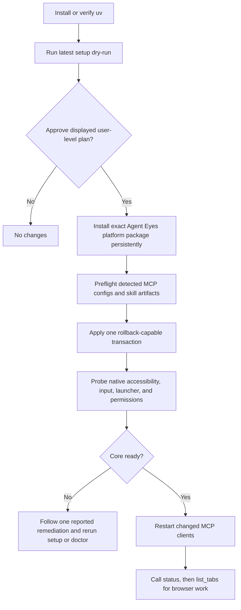

# Design Document: Install-to-Ready and MCP Reference Documentation

**Status:** Approved for implementation

**Author:** Codex

**Reviewer:** Repository owner

**Last updated:** 2026-07-22

**Release baseline:** Agent Eyes v0.9.0

## 1. Overview

Agent Eyes needs one short onboarding path and two exhaustive references. The
root README remains the entry point for a first-time user, while detailed CLI
and MCP contracts live under `docs/api/`. Parser- and schema-driven tests keep
the three documents synchronized with the executable surface.

This design preserves the existing native-first browser policy and setup model.
It also corrects small public-contract discrepancies discovered while auditing
the v0.9.0 implementation so the documentation does not describe behavior that
the executable cannot provide.

## 2. Evidence and Problem Statement

- The README starts with `uvx agent-eyes setup` but does not explain how to
  install or verify `uv` on a fresh machine ([README](../../README.md#first-time-setup)).
- The command synopsis does not include every supported option. The executable
  parser defines the complete grammar in
  [`src/agent_eyes/cli.py`](../../src/agent_eyes/cli.py).
- The README names the MCP tools but does not document required parameters,
  defaults, limits, output, errors, side effects, platform availability, or
  examples. The authoritative catalog starts in
  [`src/agent_eyes/server.py`](../../src/agent_eyes/server.py), with dynamic
  target, snapshot, and input constraints in
  [`src/agent_eyes/tool_contract.py`](../../src/agent_eyes/tool_contract.py).
- Ten MCP client integrations exist in
  [`src/agent_eyes/setup/scanner.py`](../../src/agent_eyes/setup/scanner.py), but
  their accepted `--client` IDs and configuration shapes are not enumerated for
  users.
- Existing README tests assert selected phrases rather than exhaustive command
  and tool coverage
  ([`tests/test_readme_commands.py`](../../tests/test_readme_commands.py)).

## 3. Goals

1. Let a first-time user move from an empty machine to a verified `ready` state
   without guessing the next command.
2. Explain exactly what `uvx agent-eyes@latest setup` installs, configures, and
   deliberately leaves for the user or operating system.
3. Document every CLI command, option, default, output mode, exit code, side
   effect, client ID, and supported environment override.
4. Document every exposed MCP tool with its effective schema, provider/mode,
   output, errors, side effects, platform availability, and a realistic input
   example.
5. Explain the target and snapshot lifecycle required for safe, token-efficient
   computer use.
6. Keep the documentation synchronized through executable contract tests.
7. Preserve setup idempotence, foreground-first browser reuse, explicit shadow
   opt-in, and the no-installation-during-MCP-startup boundary.

## 4. Non-Goals

- Adding a browser bridge, daemon, HTTP transport, MCP resources, or MCP prompts.
- Changing the foreground-first product policy.
- Automatically granting operating-system permissions or installing privileged
  Linux system packages.
- Generating all prose directly from JSON Schema. Generated schema alone cannot
  explain workflows, side effects, recovery, or safety boundaries clearly.
- Adding a documentation checkpoint/automation service in this change. The
  parser/schema contract tests provide focused drift prevention for the public
  surface being documented.

## 5. Considered Approaches

### A. One monolithic README

This makes every detail available on one page, but a complete 28-tool reference
would overwhelm first-time setup and make normal maintenance noisy.

### B. Layered, human-written, contract-tested documentation — selected

The README handles onboarding and common workflows. Separate CLI and MCP
references provide exhaustive detail. Tests derive command/tool names and
parameters from the executable and fail when documentation drifts.

### C. Fully generated reference

Generation guarantees syntactic coverage but produces weak explanations and
examples. It also risks treating schema/runtime discrepancies as correct rather
than surfacing them.

## 6. Information Architecture

### `README.md`

The README is organized for progressive disclosure:

1. What Agent Eyes is and the foreground-first policy.
2. Platform prerequisites, including how to obtain `uv` and Linux-specific
   `pipx`/AT-SPI requirements.
3. A five-minute install-to-ready flow:
   - preview with `uvx agent-eyes@latest setup --dry-run`;
   - apply with `uvx agent-eyes@latest setup`;
   - verify with `agent-eyes --version` and
     `agent-eyes doctor --verbose`;
   - restart changed clients;
   - verify the MCP with `status` and `list_tabs`.
4. A precise explanation of what setup installs and what it does not do.
5. Supported platform and MCP client tables.
6. One foreground workflow and one explicitly requested shadow workflow.
7. Common CLI commands with links to the exhaustive reference.
8. Readiness, troubleshooting, upgrade, repair, removal, development, and
   benchmark summaries.

The README remains useful as the PyPI project page and does not duplicate every
tool parameter.

### `docs/api/agent-eyes-cli.md`

The CLI reference follows one repeatable structure for the top-level executable
and each of `serve`, `doctor`, `install`, `init`, and `setup`:

- purpose;
- exact usage;
- arguments/options, types, defaults, and combinations;
- output and side effects;
- failure/exit behavior;
- at least one copyable example.

Cross-cutting sections document exit codes, JSON output conventions,
`AGENT_EYES_STATE_DIR`, `PIPX_BIN_DIR`, supported client IDs, configuration
artifacts, interactive/non-interactive behavior, stdout/stderr rules, and
compatibility flags.

### `docs/api/mcp-tools.md`

The MCP reference starts with cross-cutting behavior:

- local stdio transport and tools-only capability;
- platform/provider matrix;
- foreground versus explicit shadow routing;
- stable `target_id` and immutable snapshot lifecycles;
- input and result budgets;
- text content and `isError` semantics;
- exact-target and uncertain-outcome safety;
- privacy/redaction behavior.

Each exposed tool then uses the same structure:

- purpose and availability;
- parameters with requiredness, type, default, bounds, and conditional rules;
- result shape;
- errors and recovery;
- side effects and safety notes;
- realistic JSON argument example.

The reference explicitly states that the current server exposes no MCP resources
or prompts.

## 7. Setup Data Flow

The ephemeral `uvx` environment only launches the setup wizard. Setup installs
an exact-version persistent platform package and writes absolute launcher paths
to selected MCP clients. It synchronizes the canonical Agent Eyes skill for
Claude Code and Codex, plus Codex skill metadata. It does not install `uv`, run
`sudo`, grant OS permissions, approve dialogs, remove competing MCP servers, or
install packages from inside the MCP process.

## 8. Minimal Contract Alignment

Documentation is written against one truthful public contract. The
implementation changes in scope are limited to contradictions found during the
audit:

1. Classify an unknown `setup --client` value as usage error consistently with
   `init`.
2. Keep compatibility flags accepted, but make their help/reference semantics
   honest:
   - `doctor --refresh` is redundant because doctor always probes live;
   - `install --profile` is accepted for CLI compatibility but does not change
     the platform package installed;
   - `--all-detected` is an explicit spelling of the default selection.
3. Align advertised `web_tree` and `subtree` depth bounds with their runtime
   caps.
4. Encode runtime-required parameter combinations in schemas where JSON Schema
   can express them, including `find`, `click`, `wait`, `close_tab`, `hover`, and
   window mutations.
5. Correct descriptions where the runtime behavior is intentional, including
   `list_tabs.max_results` and upload path canonicalization.
6. Normalize wait validation/timeouts as MCP errors instead of successful text.
7. Do not advertise the macOS Apple Events `shadow` compatibility tool on
   platforms where its handler can only return unsupported.

No provider redesign or new automation feature is included.

## 9. Error Handling and Safety Documentation

- CLI documentation maps exit codes `0` through `5` and distinguishes usage,
  setup, action/permission, cancellation, and general failures.
- MCP documentation distinguishes schema errors, capability errors, stale
  snapshots/targets, ambiguous targets, provider-busy state, uncertain outcomes,
  timeouts, and unexpected internal failures.
- Examples never contain credentials, personal paths, or real secrets.
- Destructive examples use exact current targets and explain required refreshes.
- Shadow examples always include explicit `shadow: true` and a current
  `target_id` obtained from a shadow inventory.

## 10. Verification Strategy

### Documentation contracts

- Parse the CLI parser and assert every command and option appears in the CLI
  reference.
- Inspect the effective MCP `TOOLS` catalog after dynamic hardening and assert
  every platform-relevant tool and property appears in the MCP reference.
- Validate all repository-relative Markdown links.
- Keep canonical setup/version/doctor commands synchronized across the README
  and Agent Eyes skills.

### Runtime regression coverage

- CLI tests cover compatibility-flag help, unknown-client exit consistency,
  dry-run, JSON, cancellation, and detected/explicit client selection.
- Tool contract tests cover conditional required fields, effective bounds,
  platform catalogs, unknown properties, and error classification.
- Existing setup, server, browser policy, observation, and installed-artifact
  tests remain green.

### Command proof

Before completion:

1. Run root and all subcommand `--help` commands.
2. Run README/CLI/MCP contract tests.
3. Run lint and security checks used by the repository.
4. Run the complete test suite.
5. Build the wheel and sdist, install the wheel in isolation, and rerun the
   installed-artifact MCP smoke.
6. Run `uvx agent-eyes@latest setup --dry-run --json` outside the repository to
   verify the published first-run command remains valid.

## 11. Success Criteria

- A fresh user can reach and recognize `ready` using only the README.
- Every accepted CLI syntax is documented exactly once in the CLI reference.
- Every exposed MCP tool/property is documented exactly once in the MCP
  reference with at least one schema-valid example.
- Setup and skill behavior are explicit and match the implementation.
- Parser/schema drift causes a failing test.
- All repository quality, package, and installed-artifact gates pass.
